# ArtLedger — Master Architecture & Execution Plan

> **Project:** ArtLedger (or CanvasTrace)  
> **Repository:** [https://github.com/Nischal0258/ArtLedger.git](https://github.com/Nischal0258/ArtLedger.git)  
> **Standard:** ERC-721 + OpenZeppelin AccessControl  
> **Network:** Ethereum Sepolia Testnet (Local Hardhat Node for dev)  
> **Frontend:** Next.js 14 (App Router) + TypeScript + Tailwind CSS + RainbowKit + Wagmi v2 + Viem  
> **Storage:** Pinata / IPFS (Decentralized storage for media & JSON metadata)  
> **Security:** Client-side SHA-256 validation + On-chain RBAC + ReentrancyGuard  

---

## 1. System Architecture Overview

```mermaid
flowchart TB
    subgraph Client["Client Tier (Next.js 14 App Router)"]
        Nav["Global Shell (Navbar, Theme Toggle, Wallet Button)"]
        UI_Mint["/mint - Multi-step Artwork Registration"]
        UI_Explore["/explore - Search, Filter & Gallery Grid"]
        UI_Timeline["/artwork/[id] - Interactive Provenance Timeline"]
        UI_Action["Role Action Panel (Custody, Exhibition, Restoration, Appraisal)"]
        UI_Verify["/verify - Client-side SHA-256 Hash Verifier"]
        UI_Profile["/profile - User Dashboard (My Artworks, Roles, Activity)"]
        UI_Settings["/settings - Preferences & Network Diagnostics"]
        UI_Admin["/admin - Role Granting & Permission Control"]
    end

    subgraph Storage["Decentralized Storage Layer"]
        Pinata["Pinata Cloud API / IPFS Gateway"]
        CID_Img["Artwork Image CID"]
        CID_Meta["ERC-721 Metadata JSON CID"]
        Pinata --- CID_Img
        Pinata --- CID_Meta
    end

    subgraph EVM["EVM Layer (Sepolia Testnet / Hardhat Local)"]
        Contract["ArtLedger.sol (ERC-721 + AccessControl)"]
        RBAC["Access Control Engine (Artist, Gallery, Restorer, Appraiser)"]
        Store["State: Artworks Mapping + Provenance Array Log"]
        Events["Events: ArtworkMinted, CustodyEventLogged, UnauthorizedAttempt"]
        Contract --- RBAC
        Contract --- Store
        Contract --- Events
    end

    UI_Mint -->|"1. Upload file & metadata"| Pinata
    UI_Mint -->|"2. Mint with SHA-256 & IPFS CID"| Contract
    UI_Action -->|"3. Log event (Role-gated)"| Contract
    Contract -->|"4. getProvenance(id) & getArtwork(id)"| UI_Timeline
    UI_Verify -->|"5. Compare computed SHA-256 vs on-chain hash"| Contract
    Contract -->|"6. Token ownership & role checks"| UI_Profile
```



---

## 2. Smart Contract Specification (`ArtLedger.sol`)

### 2.1 Core Roles (OpenZeppelin `AccessControl`)
- `DEFAULT_ADMIN_ROLE`: Contract deployer; can assign and revoke roles.
- `ARTIST_ROLE` (`keccak256("ARTIST_ROLE")`): Authorized to mint new artworks.
- `GALLERY_ROLE` (`keccak256("GALLERY_ROLE")`): Authorized to log custody transfers, exhibitions, and storage relocations.
- `RESTORER_ROLE` (`keccak256("RESTORER_ROLE")`): Authorized to record conservation, structural repairs, and conditioning reports.
- `APPRAISER_ROLE` (`keccak256("APPRAISER_ROLE")`): Authorized to log valuation, insurance assessments, and authenticity reviews.

### 2.2 Data Structures
```solidity
enum EventType {
    Minted,          // 0 - Initial artwork registration
    CustodyTransfer, // 1 - Handover / acquisition
    Exhibition,      // 2 - Gallery / museum loan
    Restoration,     // 3 - Cleaning / repair work
    Appraisal,       // 4 - Official valuation / inspection
    StorageUpdate    // 5 - Relocation to vaults
}

struct Artwork {
    string  artistName;
    string  title;
    uint16  year;
    string  medium;
    bytes32 imageHash;     // Cryptographic SHA-256 digest of original file
    string  ipfsCID;       // IPFS CID of image asset
    uint256 mintedAt;      // Block timestamp
    address mintedBy;      // Minting artist address
}

struct CustodyEvent {
    EventType eventType;
    address   actor;       // Transaction sender
    bytes32   actorRole;   // Role under which actor acted
    uint256   timestamp;   // Block timestamp
    string    description; // Descriptive notes
    string    location;    // Physical location or facility
}
```

### 2.3 Contract Interface & Methods
```solidity
function mintArtwork(
    string calldata artistName,
    string calldata title,
    uint16 year,
    string calldata medium,
    bytes32 imageHash,
    string calldata ipfsCID,
    string calldata tokenURI_
) external returns (uint256);

function logCustodyEvent(
    uint256 tokenId,
    EventType eventType,
    string calldata description,
    string calldata location
) external;

function getArtwork(uint256 tokenId) external view returns (Artwork memory);
function getProvenance(uint256 tokenId) external view returns (CustodyEvent[] memory);
function getProvenanceCount(uint256 tokenId) external view returns (uint256);
function verifyImageHash(uint256 tokenId, bytes32 hash) external view returns (bool);

// Role Administration
function grantArtistRole(address account) external;
function grantGalleryRole(address account) external;
function grantRestorerRole(address account) external;
function grantAppraiserRole(address account) external;
```

### 2.4 Events & Warning Handling
- `event ArtworkMinted(uint256 indexed tokenId, address indexed artist, string title, bytes32 imageHash);`
- `event CustodyEventLogged(uint256 indexed tokenId, EventType eventType, address indexed actor, bytes32 actorRole, uint256 timestamp);`
- `event UnauthorizedAttempt(uint256 indexed tokenId, address indexed caller, string reason);` (Emitted before revert on unauthorized role access to satisfy hackathon notification specs)

---

## 3. Comprehensive Frontend UI/UX Design

To deliver an exceptional judge-ready experience, the UI includes both domain features and mandatory table-stakes UX patterns:

### 3.1 Global Shell & Foundational UX
1. **Adaptive Theme Engine**: Dark / Light mode toggle with CSS variables and `localStorage` persistence.
2. **Global Navigation Bar**:
   - Brand logo & identity (`ArtLedger`).
   - Route links (`Explore`, `Register Artwork`, `Verify`, `How It Works`).
   - Quick Search Input (direct jump by Token ID or title).
   - Network Status Indicator (Green Sepolia badge / Red Wrong Network banner).
   - RainbowKit Custom Wallet Button with user role pill (`Artist`, `Gallery`, etc.), ENS / truncated address, and copy button.
3. **Mobile Drawer**: Responsive fly-out drawer with full navigation and wallet controls for mobile / tablet devices.
4. **Global Feedback Infrastructure**:
   - **Sonner / Custom Toast System**: Live states (`⏳ Transaction Submitted`, `✅ Confirmed on Sepolia`, `❌ Transaction Reverted`, `📋 Copied to clipboard`).
   - **Skeleton Loaders**: Animated pulse skeletons on card grids, timeline entries, tables, and profile stats.
   - **Empty States**: Meaningful vector illustrations, friendly copy, and direct action CTAs (e.g., "No artworks yet - Mint your first").
   - **Error Boundaries**: Component-level fault isolation with "Try Again" triggers.
   - **Confirmation Modals**: Summary modal before invoking any on-chain transaction.
   - **Footer**: Smart contract link to Etherscan, GitHub repository link, network explorer link, and documentation.

### 3.2 Page Specifications

| Route | Functionality & Features |
|---|---|
| `/` | **Landing Showcase**: Hero banner, live stats (Total Artworks, Provenance Events Logged, Active Curators), 3-step value prop, and Recent Artworks carousel. |
| `/explore` | **Gallery & Search**: Search by title/artist/token ID, filter by Medium (Oil, Acrylic, Digital, Sculpture), sort (Newest, Oldest, Most Provenance Events), responsive 3-column card grid. |
| `/mint` | **Artwork Registration Wizard**: Step 1 (Dropzone upload, client-side SHA-256 calculation with copy, Pinata upload), Step 2 (Metadata inputs: Artist, Title, Year, Medium), Step 3 (Review, estimated gas, signature trigger), Success celebration with Token ID & direct link. |
| `/artwork/[id]` | **Provenance Timeline & Action Panel**: Full artwork preview with IPFS image, metadata badges, downloadable QR Code for physical artwork tags, chronological vertical timeline with color-coded role tags, and Role Action Panel (role-gated forms for logging transfers, exhibitions, restoration, appraisals). |
| `/verify` | **Client-side Image Verifier**: Upload any image file, compute SHA-256 digest in-browser via Web Crypto API, compare against on-chain hash for chosen Token ID, output prominent ✅ "Authentic Original" or ❌ "Hash Mismatch / Forgery Warning". |
| `/profile` | **User Portfolio & Dashboard**: Connected wallet identity, assigned roles overview, tabs for "My Minted Artworks" and "My Logged Activity", quick mint shortcuts. |
| `/settings` | **Preferences & Diagnostics**: Theme switcher (Dark / Light / System), wallet disconnect/switch options, network RPC diagnostics, contract address copy, cache management. |
| `/admin` | **Curator & Role Management**: Administrative interface to grant/revoke `Artist`, `Gallery`, `Restorer`, and `Appraiser` roles with instant table view of role holders. |
| `/how-it-works` | **Interactive Explainer**: Visual guide explaining NFT provenance, role segregation, cryptographic hashing, and physical-to-digital QR linking for non-technical judges. |
| `404 / Error` | **Custom Error Pages**: Friendly illustration and navigation paths back to dashboard/explore. |

---

## 4. Phase Breakdown & Execution Plan

| Phase | Title | Scope & Deliverables | Verification Gates |
|---|---|---|---|
| **Phase 1** | **Project Scaffolding & Environment Setup** | Monorepo structure, Hardhat configuration, Next.js 14 App Router initialization, Tailwind CSS, RainbowKit, Wagmi, Viem setup, `.env.example`, Git remote verification. | `npx hardhat --version`, `npm run dev` boots cleanly, clean directory tree. |
| **Phase 2** | **Smart Contract & Test Suite** | Implement `ArtLedger.sol` (ERC-721 + AccessControl + ReentrancyGuard), write unit tests for minting, role enforcement, provenance logging, unauthorized attempts, write `deploy.js`. | `npx hardhat test` passing with 100% coverage of core paths; compile without warnings. |
| **Phase 3** | **Frontend UI Foundation & Shared Kit** | Set up Tailwind design system (colors, dark mode), UI primitives (Skeleton, Toast, Button, Badge, EmptyState, Modal, AddressPill), Global Navbar, Mobile Drawer, Footer, and Wagmi/RainbowKit provider. | Responsive navbar renders, theme toggle works, wallet connect modal opens. |
| **Phase 4** | **Core Provenance Workflows** | Build `/mint` (registration wizard), `/artwork/[id]` (public timeline + Role Action Panel), and `/verify` (client-side SHA-256 comparison). | Interactive forms with client validation and ABI bindings configured. |
| **Phase 5** | **IPFS Integration & Cryptographic Utilities** | Implement `lib/ipfs.ts` (Pinata upload for images & metadata JSON), `lib/hash.ts` (SHA-256 Web Crypto utility), integrate into minting & verification pipelines. | Upload mock file -> returns IPFS CID; hash calculation matches standard SHA-256 tools. |
| **Phase 6** | **Extended Pages (Table-Stakes Polish)** | Build `/explore` (search & filter grid), `/profile` (dashboard), `/admin` (role assignment), `/settings`, `/how-it-works`, and `not-found.tsx`. | All navigation routes functional, empty states and loading skeletons present. |
| **Phase 7** | **Integration, Local/Testnet Deployment, Demo Prep** | Deploy contract to Hardhat local node / Sepolia, wire contract address to frontend, run full demo sequence (Mint 1 artwork, log 3 distinct role events, verify hash, generate QR code), generate presentation artifacts. | End-to-end user journey executed and verified; demo walkthrough script ready. |

---

## 5. Git Commit & Progress Logging Protocol

### 5.1 Protocol Rules
1. **Never start a phase without explicit user approval.**
2. **At the conclusion of each phase:**
   - Execute all verification tests.
   - Stage all changed and created files (`git add .`).
   - Create a clean semantic commit: `git commit -m "feat(phase-X): <description>"`.
   - Push immediately to GitHub: `git push origin main`.
   - Update `PROGRESS.md` with timestamp, commit hash, files modified, and verification results.
3. **Session Recovery Guarantee:** If the connection or credits drop, any new agent can read `PROGRESS.md`, check the last completed phase and commit hash, and resume immediately.
